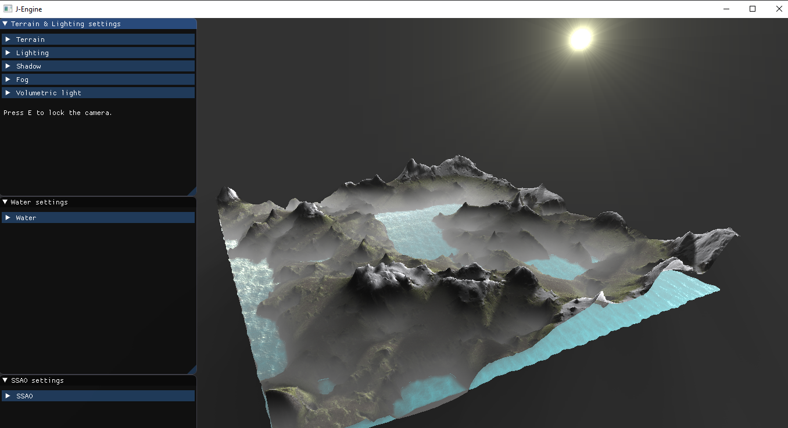

##### October 15, 2019
# J-Engine

J-Engine is a tiny terrain render engine I've built over the past ~6 weeks in order to get accustomed to the OpenGL rendering pipeline.

## Features
* Prodecural terrain
* Water simulation based on a summation of Gerstner waves
* Shadows
* Fog
* Volumetric lighting
* Screen space ambient occlusion

## Screenshots



## Folder structure
```
└───J-Engine
    ├───cmake
    ├───executable
    │   ├───images
    │   │   └───textures
    │   └───shaderfiles
    ├───images
    │   └───textures
    ├───screenshots
    ├───shaderfiles
    ├───src
    └───thirdparty
 ```

## How to build (using cmake)

Launch your favorite terminal and clone the github repository using:
```
git clone https://github.com/JThissen/J-Engine.git
```
Next, create a build folder in the J-Engine directory and change the current working directory to the newly created build folder:
```
mkdir build
```
```
cd build
```
Lastly, run cmake to build the solution using:
```
cmake ..
```

## .Exe
Additionally, a stand-alone executable is included in the folder [executable](https://github.com/JThissen/J-Engine/tree/master/executable).

## A bunch of helpful resources
* [Basics of OpenGL](https://learnopengl.com/)
* [OpenGL cookbooks](https://www.google.com/search?q=opengl+cookbook&sxsrf=ACYBGNTCLk4F9Zb9sgre8FbZblqyFuXLLQ:1571147116903&source=lnms&sa=X&ved=0ahUKEwj10quOs57lAhUP-aQKHWWMCu4Q_AUIDSgA&biw=1517&bih=741&dpr=0.9)
* [GPU Gems - all editions](https://developer.nvidia.com/gpugems/GPUGems/gpugems_pref01.html)
###### ...and a lot of googling obviously!
