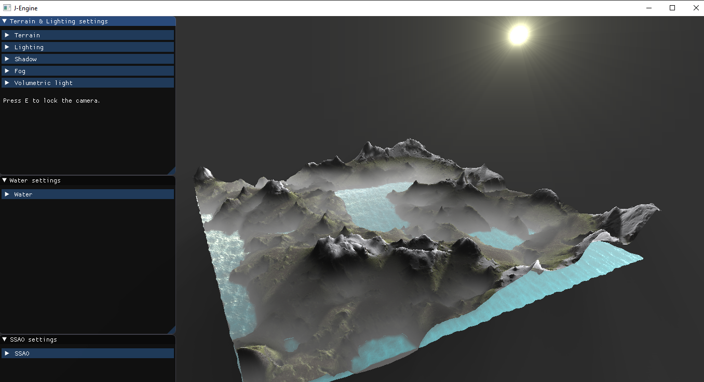
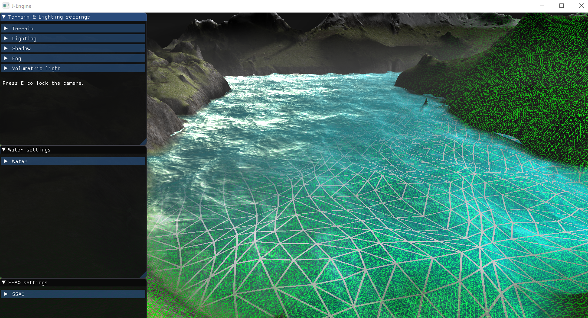

##### October 15, 2019

# J-Engine

J-Engine is a tiny terrain render engine I've built over the past ~6 weeks in order to get accustomed to the OpenGL rendering pipeline.

## Features

- Procedural terrain
- Water simulation based on a summation of Gerstner waves
- Shadows
- Fog
- Volumetric lighting
- Screen space ambient occlusion

## Screenshots




## Folder structure

```
└───J-Engine
    ├───cmake
	├───executable
	├───images
	│   ├───sphere
	│   └───textures
	├───include
	│   ├───assimp
	│   │   └───Compiler
	│   ├───glad
	│   ├───GLFW
	│   ├───glm
	│   │   ├───detail
	│   │   ├───gtc
	│   │   ├───gtx
	│   │   └───simd
	│   ├───imgui
	│   └───KHR
	├───lib
	│   └───assimp
	├───screenshots
	├───shaderfiles
	├───src
	└───thirdparty
```

## How to use

Launch your favorite terminal and clone the github repository using:

```
git clone https://github.com/JThissen/J-Engine.git
```

Next, run the solution (.sln) and build the project.

### cmake

Create a build folder in the JEngine directory (project directory) and change the current working directory to the newly created build folder:

```
mkdir build
```

```
cd build
```

Lastly, run cmake to build the solution using:

```
cmake ..
```

Finally, run the generated solution (.sln) and build the project.

## .Exe

Additionally, a stand-alone executable is included in the folder [executable](https://github.com/JThissen/J-Engine/tree/master/executable).

## A bunch of helpful resources

- [Basics of OpenGL](https://learnopengl.com/)
- [OpenGL cookbooks](https://www.google.com/search?q=opengl+cookbook&sxsrf=ACYBGNTCLk4F9Zb9sgre8FbZblqyFuXLLQ:1571147116903&source=lnms&sa=X&ved=0ahUKEwj10quOs57lAhUP-aQKHWWMCu4Q_AUIDSgA&biw=1517&bih=741&dpr=0.9)
- [GPU Gems - all editions](https://developer.nvidia.com/gpugems/GPUGems/gpugems_pref01.html)
